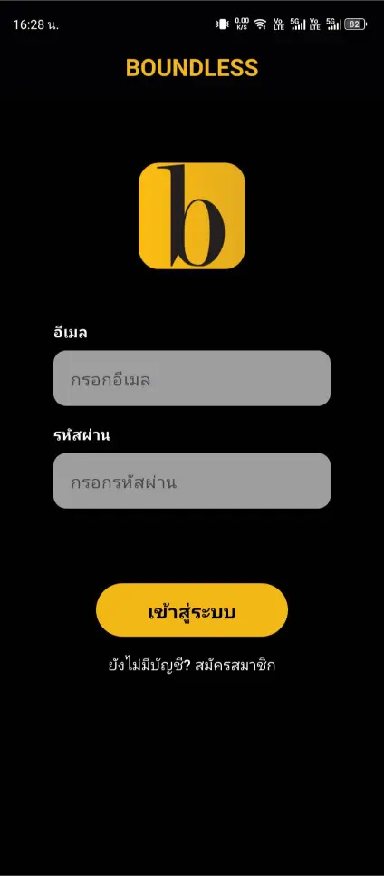
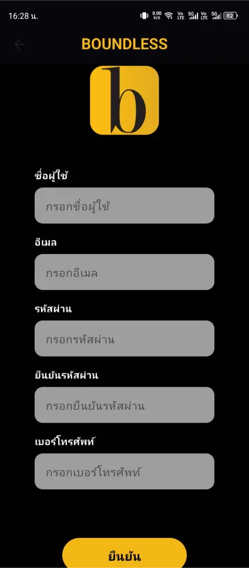
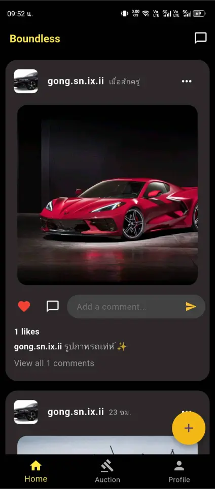
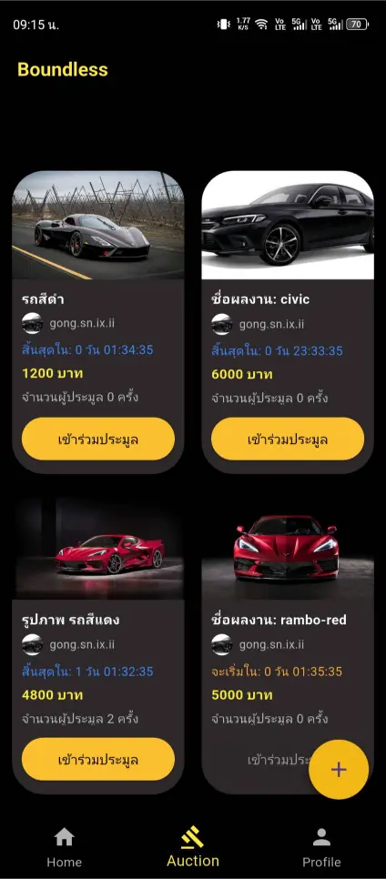
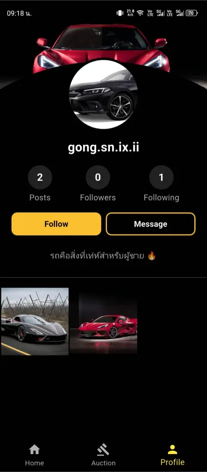
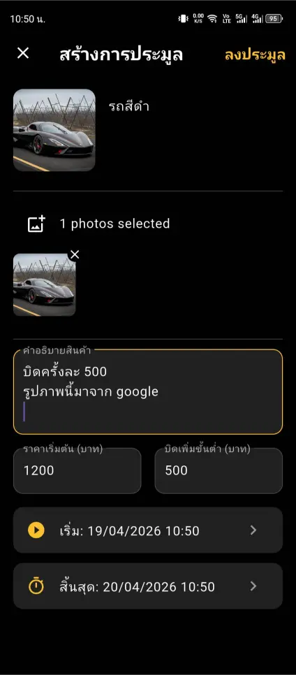
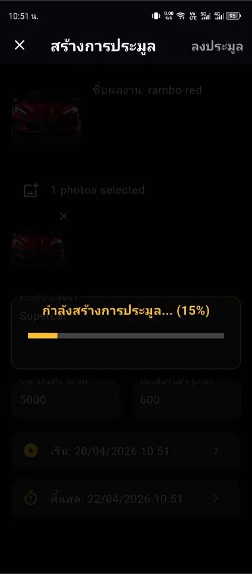
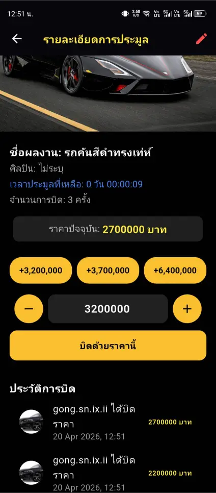
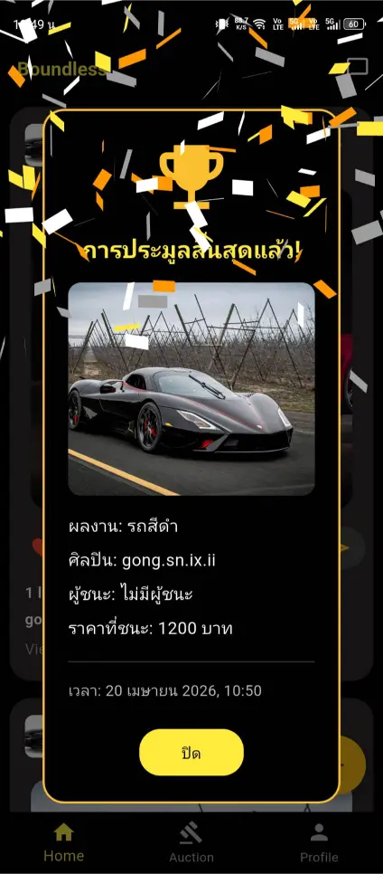

<div align="center">

# 🌐 Boundless

### แพลตฟอร์ม Real-time Auction & Social Network บนมือถือ

*แอปประมูลที่รวมคอมมิวนิตี้ไว้ในที่เดียว — ประมูลสด แชท ติดตาม กดไลค์ ครบจบในแอปเดียว*

[](https://flutter.dev)
[](https://dart.dev)
[](https://firebase.google.com)
[](https://developer.android.com/studio)

[](https://github.com/gong-sn-ix-ii/Boundless)
[](https://flutter.dev)
[](https://gong-ix-ii-dev.com)

</div>

---

## ✨ ภาพรวมโปรเจกต์

**Boundless** คือแอปพลิเคชันประมูลสินค้าและ Social Network แบบ **Real-time** ที่รวมทุกไลฟ์สไตล์ไว้ในที่เดียว ผู้ใช้สามารถประมูลสินค้าแบบสด ๆ พร้อมกับติดตามเพื่อน กดไลค์ แชท และโพสต์ได้ในแอปเดียว

ระบบทำงานบนสถาปัตยกรรม **Firebase Real-time Database** ทำให้ทุกการเสนอราคา (Bid), ข้อความแชท, และการแจ้งเตือนผู้ชนะประมูล อัปเดตถึงผู้ใช้ทุกคนทันที **โดยไม่ต้องรีเฟรชหน้าจอ**

> 💡 **จุดเด่น**
> ผสมประสบการณ์ของ Marketplace + Social Media เข้าด้วยกัน — ผู้ใช้ไม่ได้แค่ซื้อขาย แต่สร้างคอมมิวนิตี้ติดตามผู้ขายที่ชอบ และมีปฏิสัมพันธ์กันได้ตลอดเวลา

---

## 🎯 ฟีเจอร์หลัก

| ฟีเจอร์ | รายละเอียด |
|---|---|
| ⚡ **Real-time Bidding** | ระบบเสนอราคาแบบ Real-time ผ่าน Firebase ทุกการ Bid อัปเดตทันทีให้ผู้เข้าร่วมประมูลทุกคนเห็น |
| 💬 **Social Connect** | ระบบโซเชียลในตัว — ติดตามผู้ใช้, กดไลค์โพสต์, แชทแบบสด, และแชร์รายการประมูล |
| 🔔 **Smart Notifications** | แจ้งเตือนอัจฉริยะเมื่อมีคนเสนอราคาสูงกว่า หรือเมื่อคุณเป็นผู้ชนะการประมูล |
| 👤 **Profile Management** | จัดการข้อมูลส่วนตัว, ประวัติโพสต์, จำนวนผู้ติดตาม และ Dashboard ของรายการประมูล |
| 📦 **Listing Management** | สร้าง, จัดการ, และตรวจสอบสถานะรายการประมูลแบบเรียลไทม์ |
| 🏆 **Auto Winner System** | ระบบประกาศผู้ชนะอัตโนมัติ พร้อมส่ง Push Notification ให้ผู้เข้าร่วมประมูลทุกคน |

---

## 📱 หน้าจอการใช้งาน (10 หน้า)

<table>
<tr>
<td width="50%">

### 1. หน้าแรก (Welcome)


หน้าหลักสำหรับเข้าสู่ระบบหรือสมัครสมาชิก

</td>
<td width="50%">

### 2. สมัครสมาชิก


หน้าลงทะเบียนและสร้างบัญชีผู้ใช้งานใหม่

</td>
</tr>
<tr>
<td width="50%">

### 3. โซเชียลฟีด


แสดงฟีดและโพสต์ต่าง ๆ ของผู้ใช้ที่ติดตาม

</td>
<td width="50%">

### 4. ตลาดประมูล (Marketplace)


เข้าร่วมการประมูลสินค้า รูปภาพ และรายการต่าง ๆ

</td>
</tr>
<tr>
<td width="50%">

### 5. โปรไฟล์ผู้ใช้


จัดการข้อมูลส่วนตัว ข้อมูลโพสต์ และจำนวนผู้ติดตาม

</td>
<td width="50%">

### 6. ห้องประมูลสด (Live Auction)


เข้าร่วมการประมูล พร้อมแสดงรายละเอียดการ Bid และราคาปัจจุบัน

</td>
</tr>
<tr>
<td width="50%">

### 7. สร้างรายการประมูล


ตั้งค่าและจัดการข้อมูลเพื่อเปิดประมูลสินค้าใหม่

</td>
<td width="50%">

### 8. สถานะรายการ


แสดงสถานะการสร้างโพสต์ประมูลสินค้าเข้าสู่ระบบ

</td>
</tr>
<tr>
<td width="50%">

### 9. Auction Dashboard


ผู้จัดการประมูลสามารถแก้ไขและตรวจสอบสถานะการประมูลล่าสุด

</td>
<td width="50%">

### 10. ผลประมูล & แจ้งเตือน


แสดงผลผู้ชนะและส่ง Notification แบบ Real-time ทันที

</td>
</tr>
</table>

---

## 🛠 เทคโนโลยีที่ใช้

<div align="center">

| | Technology | บทบาท |
|---|---|---|
|  | **Flutter** | Cross-platform UI Framework สำหรับ Android & iOS |
|  | **Dart** | ภาษาหลักในการเขียน Logic ของแอป |
|  | **Firebase** | Real-time Database, Authentication, Cloud Messaging |
|  | **Android Studio** | IDE หลักสำหรับพัฒนา |

</div>

---

## 🚀 วิธีติดตั้งและรันโปรเจกต์

### สิ่งที่ต้องเตรียม (Prerequisites)

- Flutter SDK `>= 3.0.0`
- Dart SDK `>= 3.0.0`
- Android Studio หรือ VS Code (ติดตั้ง Flutter plugin แล้ว)
- Firebase Project ที่เปิด Authentication, Firestore, Cloud Messaging

### ขั้นตอนการติดตั้ง

```bash
# 1. Clone repository
git clone https://github.com/gong-sn-ix-ii/Boundless.git
cd Boundless

# 2. ติดตั้ง dependencies ทั้งหมด
flutter pub get

# 3. เชื่อมต่อ Firebase Project ของคุณ
# วาง google-services.json ไว้ที่ android/app/
# วาง GoogleService-Info.plist ไว้ที่ ios/Runner/

# 4. รันแอปพลิเคชัน
flutter run
```

### Build สำหรับ Production

```bash
flutter build apk --release       # สำหรับ Android
flutter build ios --release       # สำหรับ iOS
```

---

## 📂 โครงสร้างโปรเจกต์

```
Boundless/
├── lib/
│   ├── main.dart                 # จุดเริ่มต้นของแอป
│   ├── screens/                  # 10 หน้าจอหลัก
│   ├── widgets/                  # UI Components ที่ใช้ซ้ำ
│   ├── services/                 # Firebase + Business Logic
│   ├── models/                   # Data Models
│   └── utils/                    # Helpers & Constants
├── assets/
│   └── images/
├── android/
├── ios/
└── pubspec.yaml
```

---

## 👨‍💻 ผู้พัฒนา

<table>
<tr>
<td>

### Kitsada Khamnuan (กฤษฎา คำนวน)

*Junior Software Engineer · Mobile Developer · Cybersecurity Enthusiast*

📍 ชลบุรี / กรุงเทพฯ, ประเทศไทย

🌐 **Portfolio:** [gong-ix-ii-dev.com](https://gong-ix-ii-dev.com)
💼 **GitHub:** [@gong-sn-ix-ii](https://github.com/gong-sn-ix-ii)
💬 **LinkedIn:** [Kitsada Khamnuan](https://www.linkedin.com/in/kitsada-khamnuan-2a6729407/)

</td>
</tr>
</table>

---

## 📄 License

โปรเจกต์นี้พัฒนาเพื่อการศึกษาและใช้เป็น Portfolio กรุณาติดต่อผู้พัฒนาก่อนนำไปใช้ในเชิงพาณิชย์

---

<div align="center">

**⭐ ถ้าคุณชอบโปรเจกต์นี้ ฝากกด Star เป็นกำลังใจให้ผู้พัฒนาด้วยนะครับ ⭐**

Made with 💛 by [Kitsada Khamnuan](https://gong-ix-ii-dev.com)

</div>

---

> ### 📌 หมายเหตุการ Setup (ลบ section นี้ก่อน commit จริง)
>
> รูปภาพอ้างอิงจาก `docs/screenshots/1.webp` ถึง `10.webp` ก่อน push ให้ก๊อปรูป 10 ไฟล์ `.webp` จาก Portfolio repo มาวางไว้ก่อน:
>
> ```
> จาก: Portfolio/src/assets/images/projects/boundless/1-10.webp
> ไปยัง: Boundless/docs/screenshots/1-10.webp
> ```
>
> **ทางเลือก:** ถ้าไม่อยากก๊อปรูป สามารถเปลี่ยน `docs/screenshots/N.webp` เป็น raw URL ของ Portfolio repo ตรง ๆ:
> `https://raw.githubusercontent.com/gong-sn-ix-ii/Portfolio/main/src/assets/images/projects/boundless/N.webp`
